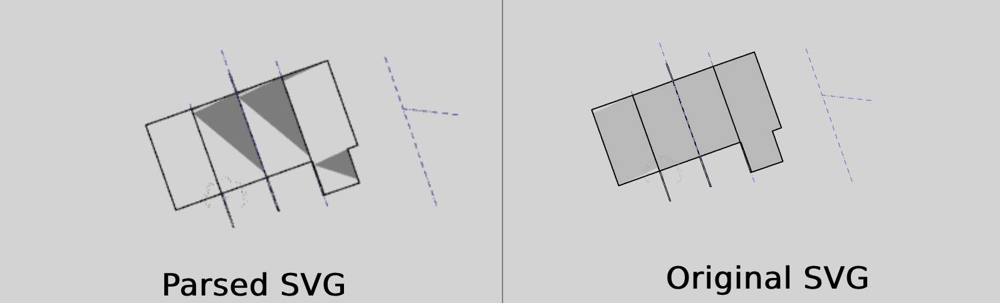

# Threejs svg parser

This repository highlights some edge cases not handled by [SvgLoader](https://threejs.org/docs/#examples/en/loaders/SVGLoader).



For complex and large SVG files (>20 MB), SvgLoader produces some undesired results, particularly with path elements as far as I can tell. Possible areas for investigation and improvement include:

-   The SvgLoader parse function
-   Clockwise/counterclockwise path issues
-   Incorrect "d" attributes in SVG path elements

The files in the [./public](./public/) folder isolate specific parts of complex SVG files that produce these issues. Some of the SVG files in the repository have been optimized using the [svgo](https://www.npmjs.com/package/svgo) library with the following plugins:

-   removeDoctype
-   removeXMLProcInst
-   removeComments
-   removeMetadata
-   removeEditorsNSData
-   cleanupAttrs
-   mergeStyles
-   inlineStyles
-   minifyStyles
-   cleanupIds
-   removeUselessDefs
-   convertColors
-   removeUnknownsAndDefaults
-   removeNonInheritableGroupAttrs
-   removeUselessStrokeAndFill
-   cleanupEnableBackground
-   removeHiddenElems
-   removeEmptyText
-   collapseGroups
-   convertPathData
-   convertTransform
-   removeEmptyAttrs
-   removeEmptyContainers
-   removeUnusedNS
-   sortAttrs
-   sortDefsChildren
-   removeTitle
-   removeDesc

## scripts

```
npm i
npm run dev
```
